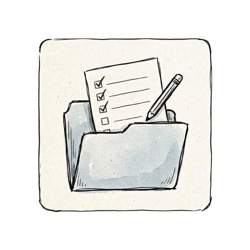

<p align="center">
  
</p>

<p align="center">
  
  
  
  
  
  
</p>

# GameDevManager

Ein Verwaltungstool für die Spieleentwicklung. Damit baust du vor und während der Entwicklung ein strukturiertes Wiki für deine Spielwelt auf und exportierst die Inhalte später in deine Game Engine.

**Status: Alle Module umgesetzt.** Sämtliche Punkte des Konzepts sind gebaut — zuletzt Benutzeranmeldung und Änderungsprotokoll, der Freischaltungs-Baum, das Welt-Modul (Tageszeit/Wetter/Biome), der Feldtyp „Formel/Kurve“ für Levelkurven und Schadensformeln — dessen Diagramm zeichnet inzwischen mehrere Kurven aus dem Projekt übereinander, damit sich Spieler gegen Gegner oder Klasse A gegen B **vergleichen** lässt — sowie Textfelder, die als **Stichwortliste** mehrere Werte aufnehmen (Elemente, Schadensarten).

## Worum geht es?

GameDevManager richtet sich an Indie-Entwickler, die den fachlichen Teil ihres Spiels planen wollen: Items, NPCs, Quests, Dialoge, Karten, Fraktionen. Alles liegt an einem Ort und ist miteinander verknüpft, statt über verstreute Dokumente und Tabellen verteilt zu sein. Technische Dinge wie Code oder Engine-Konfiguration gehören bewusst nicht dazu.

## Die Idee

Man legt seine Daten strukturiert während Planungsphasen an und kann diese später und im laufe der Entwicklung Versioniert in seine Gameengine importieren und fertige Game Objekte erhalten, welche nur noch benutzt werden müssen.

## Datenbank

Das Tool ist self-hosted und lässt die Datenbank frei wählen (`Database:Provider` in den appsettings): **SQL Server, PostgreSQL, MySQL, SQLite und Oracle** — je Provider mit eigenem Migrations-Projekt, SQLite als Vorgabe für den schnellen Start. Für Oracle ist die kostenlose **Database Free (23ai)** die Referenz; die Anbindung läuft über Oracles offiziellen EF-Core-Provider. MariaDB steht auf der Liste, wartet aber auf eine Pomelo-Fassung für EF Core 10 — der bisherige MySQL-Provider (Oracles `MySql.EntityFrameworkCore`) unterstützt MariaDB offiziell nicht.

## Geplante Module

| Modul | Beschreibung |
|---|---|
| Items | Items mit Name, Sprite und Werten definieren; Item-Arten mit eigenen Feldern (auch Stichwortlisten für mehrere Werte in einem Feld) und Unterarten, die diese Felder erben |
| Crafting | Rezepte aus Ziel-Items, benötigten Items und einer Rezept-Art; filterbare Rezeptliste, Crafting-Trees als Graph |
| Währungen | Beliebig viele Ingame-Währungen, die Händler akzeptieren |
| NPCs | NPCs und Mobs mit Arten, Händler- und Quest-Rollen, Shop-Sortiment mit Preisen, Lagerbestand und Auffüllzeiten, Spawn-Orte auf der Karte |
| Fraktionen | Fraktionen mit Rollen und Rängen für zugeordnete NPCs |
| Diplomatie | Beziehungen zwischen Fraktionen (Allianzen, Feindschaften) als Graph |
| Karten | Welt-, Höhlen- und Gebäudekarten als Bilder; Marker für NPCs, Fraktionsgebiete als Kreis oder gezeichnetes Polygon; verlinkte Karten, etwa ein Hausinnenraum auf der Weltkarte |
| Dialoge | Dialoge zwischen NPCs und Spieler mit Antwortmöglichkeiten und Bedingungen; Gespräche zusätzlich als Graph, in dem Verzweigungen und unerreichbare Zeilen sichtbar werden; auch ambiente Sprechblasen |
| Story | Storyline auf einem Zeitstrahl, verknüpft mit NPCs, Fraktionen und Orten |
| Quests | Haupt- und Nebenmissionen sowie Events, an Story und Dialoge angelehnt, mit Bedingungen |
| Loot-Tables | Drop-Wahrscheinlichkeiten und Mengen, direkt mit Items und NPCs verknüpft |
| Effekte | Effekte und ihre Wirkung (etwa Verbrennung), zuweisbar an Items |
| Spieler | Spielerfigur und Skilltrees samt Freischaltkosten |
| Klassen | Klassen mit Fähigkeiten, mappbar auf Spieler und NPCs |
| Achievements | Erfolge, die der Spieler erreichen kann |
| Sammelobjekte | Sammelbare Objekte wie Statuen oder Notizen |
| Events | Zufallsereignisse mit Mob-Spawns, Belohnungs-Loot und Einschränkungen auf bestimmte Orte |
| Tags | Zentrale Tag-Verwaltung, pro Modul konfigurierbar |
| Asset-Bibliothek | Alle Sprites nach Modul gruppiert, mit Primär-Sprite pro Entität, Tags und Upload-Verwaltung |
| Welt | Tageszeiten, Wetterlagen und Biome als benannte Zustände, an denen Spawns, Shops und Events über Bedingungen hängen |
| Statistik | Kennzahlen wie Anzahl der Items oder NPCs, dazu Health Checks: zyklische Rezepte, toter Content, Quests ohne Abschluss, Dialog-Sackgassen, Loot-Wahrscheinlichkeiten über 100 %, verwaiste Sprites, unerfüllbare Bedingungen, Ringe im Freischaltungs-Baum |
| Freischaltungen | Der Tech-Tree als Graph: was schaltet was frei — gelesen aus dem Bedingungssystem, ohne eigene Daten |
| Änderungen | Änderungsprotokoll je Entität: wer hat wann was angelegt, geändert oder gelöscht |
| SFX / Audio | Ansammlung an Audio Files |
| Cutscenes | Sammlung von Video Files |

## Benutzer & Änderungsprotokoll

Das Tool liegt hinter einer Anmeldung. Angemeldet wird direkt auf dem **Startscreen**: Das Formular steht dort, wo für den Angemeldeten der Start-Knopf sitzt — mit Inhaltsregen, Farbebenen und Partikeln dahinter. Beim ersten Start führt der Weg in die **Ersteinrichtung**, in der man das erste Konto anlegt — ein ausgeliefertes Standardpasswort gibt es bewusst nicht. Passwörter stehen nur als PBKDF2-Hash in der Datenbank; Benutzer gehören der Installation und nicht einem Projekt. Unterschieden wird allein, wer weitere Benutzer verwalten darf.

Darauf baut das **Änderungsprotokoll** auf: Jedes Anlegen, Ändern und Löschen einer Entität landet mit Zeitpunkt, Benutzer und den geänderten Eigenschaften unter „Änderungen“, filterbar nach Modul, Benutzer und Art der Änderung. Ein Import erscheint als ein einziger Eintrag statt als tausend. Wer wissen will, was mit *einer* Entität geschehen ist, muss dorthin gar nicht erst: Jede Bearbeitungsmaske zeigt neben der Referenzansicht den Abschnitt **„Geschichte“** mit den jüngsten Einträgen genau dieser Entität. Dazu kommt eine **Schreibkonflikt-Erkennung**: Wer auf einem Stand speichert, den inzwischen jemand anderes geändert hat, bekommt eine Meldung statt die fremde Arbeit stillschweigend zu überschreiben. Damit das Protokoll nicht endlos wächst, kürzt es ein täglicher Wartungslauf auf die eingestellte **Aufbewahrung** (`ChangeLog:MaxAgeDays`, Vorgabe ein Jahr, und `ChangeLog:MaxPerProject`, Vorgabe aus); die geltende Regel steht auf der Seite, und Verwalter können sie über „Jetzt aufräumen“ sofort anwenden.

## Sprache der Oberfläche

Die Bedienoberfläche gibt es auf Deutsch und Englisch; gewählt wird sie unter „Einstellungen → Darstellung“, die Wahl gilt installationsweit und übersteht einen Neustart. Deutsch ist die neutrale Fassung — englische Texte liegen als Satelliten-Dateien daneben. Übersetzt sind bisher die geteilten Ebenen (alle Meldungen und Prüftexte, Modul- und Feldbeschriftungen, Rahmen, Dashboard, Start- und Fehlerseiten); die Texte der einzelnen Modulseiten stehen noch aus und erscheinen dort weiter auf Deutsch.

## Lokalisierung der Spielinhalte

Davon getrennt lassen sich die **Spielinhalte** in mehreren Sprachen pflegen. Eine Sprache je Projekt ist die **Ausgangssprache** — ihre Texte stehen dort, wo sie ohnehin stehen: im Namen der Entität, ihrer Beschreibung und ihren Textfeldern. Alle weiteren Sprachen hängen als Übersetzung daneben, ein Projekt mit nur einer Sprache zahlt also nichts dafür.

Übersetzt wird auf einer eigenen Seite quer über den Bestand: Zielsprache und Modul wählen, „nur Offenes“ einschalten, Zeile für Zeile eintragen — gespeichert wird je Zelle. Ändert sich ein Original, gilt seine Übersetzung als **veraltet** statt still falsch zu bleiben; die Fortschrittsanzeige zählt beides getrennt. Im Export steht der ganze Bestand als `content/localization.json`, dazu je Sprache eine fertige Zeichenketten-Tabelle unter `localization/` — die Sprachwahl fällt damit im Spiel, nicht im Export.

## Lesende HTTP-API

Neben dem ZIP-Export gibt es eine **nur lesende** HTTP-API — die Grundlage für ein Editor-Plugin, das den Stand direkt zieht:

```
GET /api/v1/projects
GET /api/v1/modules
GET /api/v1/projects/{projektId}/modules/items
GET /api/v1/projects/{projektId}/modules/items?language=en
GET /api/v1/projects/{projektId}/modules/items/{eintragId}
```

Angemeldet wird über einen **API-Schlüssel** im Header `X-API-Key` (alternativ `Authorization: Bearer …`). Schlüssel legt ein Verwalter unter „API-Schlüssel“ an: mit Namen, wahlweise auf ein Projekt beschränkt und mit Ablaufdatum; sperren und löschen geht dort ebenso. Gespeichert wird nur ihr Hash — der Klartext steht genau einmal da, nach dem Anlegen. Geschrieben werden kann über die API bewusst nichts: Das wäre ein zweiter Weg an Rechteprüfung, Änderungsprotokoll und Schreibkonflikt-Erkennung vorbei.

## Import & Export

Die Seite „Import &amp; Export“ deckt den kompletten Kreislauf ab:

- **Export** als JSON zusammen mit Bildern, Sounds und VFX als ZIP-Archiv — wahlweise im Ordner-Layout von Unity, Unreal Engine oder Godot, damit sich das Archiv direkt ins Engine-Projekt entpacken lässt
- **Import** des Export-ZIPs, um ein Projekt umzuziehen oder eine Sicherung wiederherzustellen (alle GUID-Referenzen bleiben erhalten)
- **Exportstände**: Stände lassen sich aufbewahren, herunterladen und paarweise — oder gegen den aktuellen Stand — vergleichen; der Diff zeigt je Modul, was dazukam, wegfiel und welche Eigenschaften sich geändert haben
- **Engine-Presets**: Je Engine lässt sich ein Bauplan hinterlegen („so sieht ein NPC in Unity aus“) — Modul, optional eine Art, der Typname in der Engine und die Zuordnung Eigenschaft → Quelle. Beim Export in diese Engine entstehen daraus unter `engine/` fertige Objekte: eine `ScriptableObject`-Klasse plus Werte je Eintrag (Unity), eine DataTable-taugliche CSV (Unreal) oder eine `.tres`-Ressource je Eintrag (Godot)
- **CSV je Modul**: Ein einzelnes Modul als Tabelle herunterladen, in der Tabellenkalkulation pflegen und wieder einlesen — der Weg, auf dem Balancing-Zahlen entstehen. Der Import aktualisiert über die Spalte `id`, sonst über `name`, und lässt alles unangetastet, was in keiner Zeile steht
- **Sicherheitsnetz**: Vor einem ersetzenden Import und vor dem Löschen eines Projekts entsteht automatisch ein Exportstand — der bisherige Bestand ist damit immer wiederherstellbar
- **Aufbewahrung**: Damit das Verzeichnis nicht endlos wächst, fallen alte Stände nach einer Obergrenze je Projekt und wahlweise nach einem Höchstalter weg (`Exports:MaxPerProject`, Vorgabe 20, und `Exports:MaxAgeDays`, Vorgabe aus); der jüngste Stand bleibt in jedem Fall stehen
- **Hinweis statt Sperre**: Offene Health-Check-Funde zeigt die Seite vor dem Export an, blockiert ihn aber nicht — ein Zwischenstand muss sich exportieren lassen

Projekte lassen sich über dieselbe Strecke **duplizieren** („Kopie anlegen“ auf der Projektseite): Der Stand wird flüchtig exportiert, alle GUIDs werden neu vergeben und in ein frisches Projekt eingespielt. Einzelne Einträge kopiert dagegen „Als Vorlage kopieren“ in jeder Modul-Liste — mit Feldwerten, individuellen Feldern und Bedingungen, aber weiterhin auf dieselben fremden Entitäten verweisend.

## Roadmap

1. Konzept ausarbeiten - Ham wa drin 👌
2. Kern-Architektur: Entitätenmodell, eigene Arten und Felder, GUID-Referenzen, Bedingungssystem - Ham wa drin 👌
3. Erste Module: Dashboard, Items, Asset-Bibliothek - Ham wa drin 👌
4. Darauf aufbauend: Crafting, NPCs, Loot-Tables, Karten - Ham wa drin 👌
5. Story-Ebene: Dialoge, Story, Quests, Events - Ham wa drin 👌
6. Erweiterung und Härtung bestehende Module - Ham wa drin 👌
7. Import/Export in JSON mit Sprites/Assets als ZIP, inkl. Exportständen mit Diff - Ham wa drin 👌
8. Import/Export mit Engine-Anbindung (Ordner-Layouts für Unity/Unreal/Godot sowie engine-native Dateien aus Presets - Ham wa drin 👌)
9. Benutzeranmeldung und Änderungsprotokoll - Ham wa drin 👌

## Lizenz

MIT, siehe [LICENSE](LICENSE).
